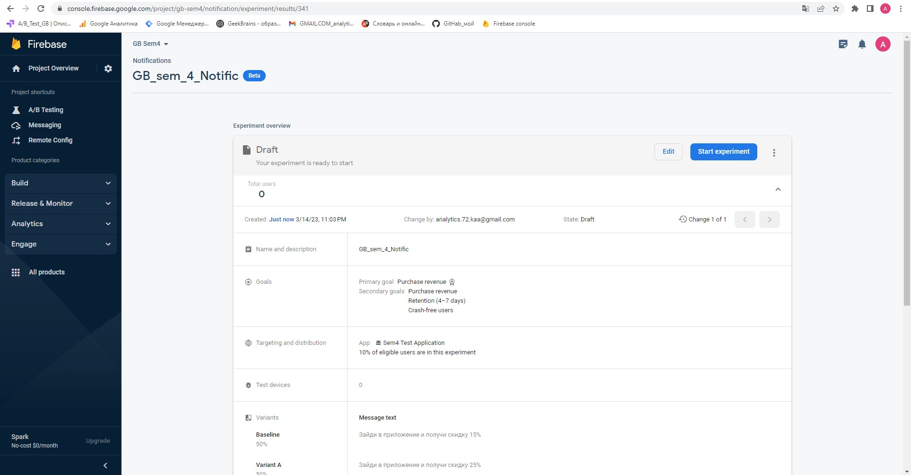
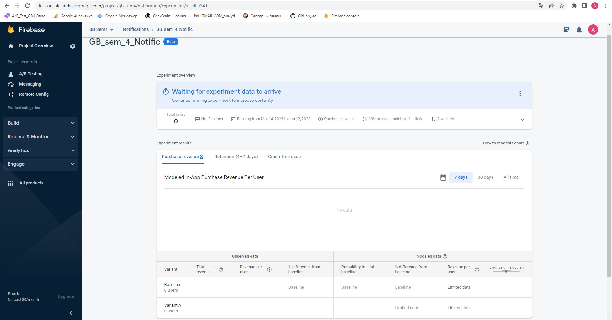
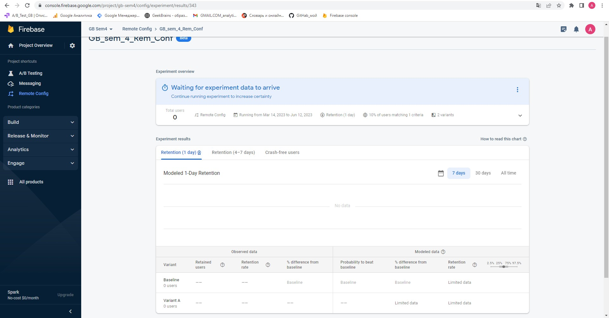
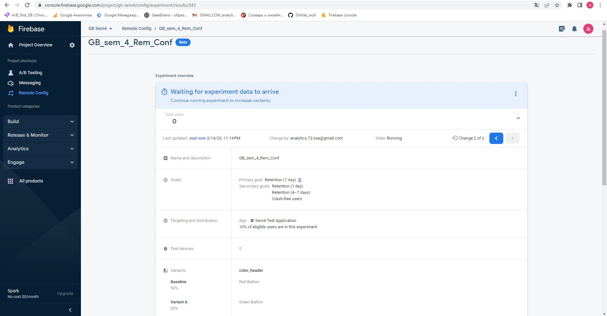
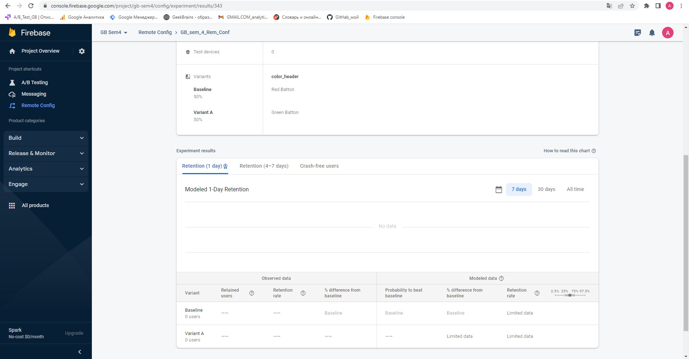
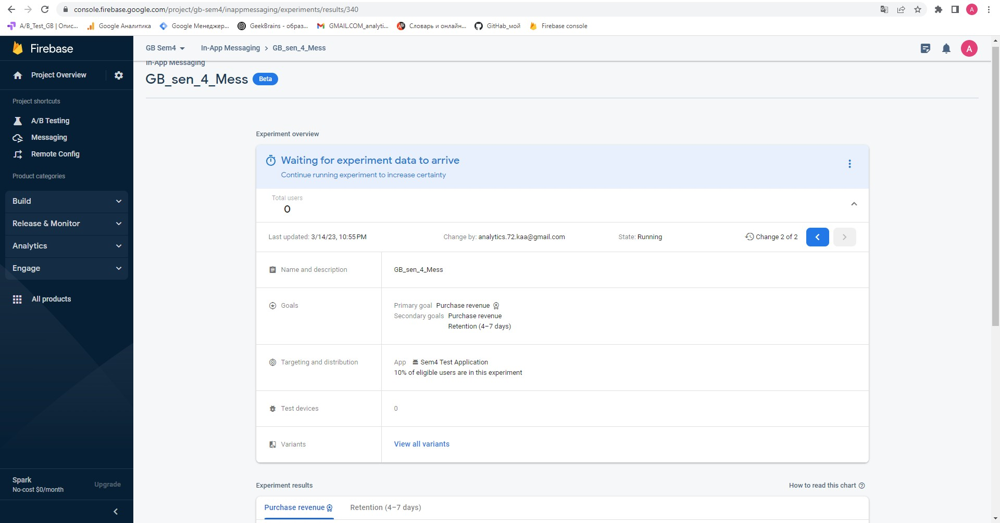
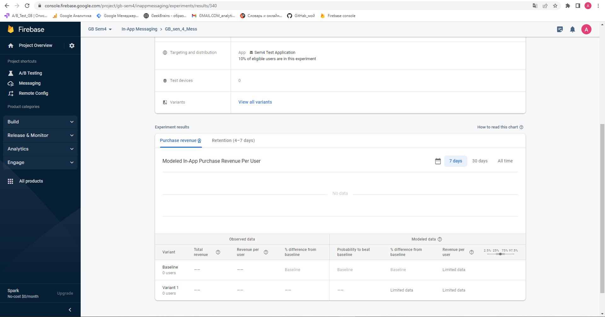

## A/B-тестирование (семинары).
## Урок 4.
### A/B-тестирование мобильных приложений.

Настроить а/б тест на сайте с 2-мя изменениями на своем сайте либо,  
на аккаунте преподавателя(доступ по запросу).

Уведомления  
Remote config  
In-app сообщения.

### Решение:

