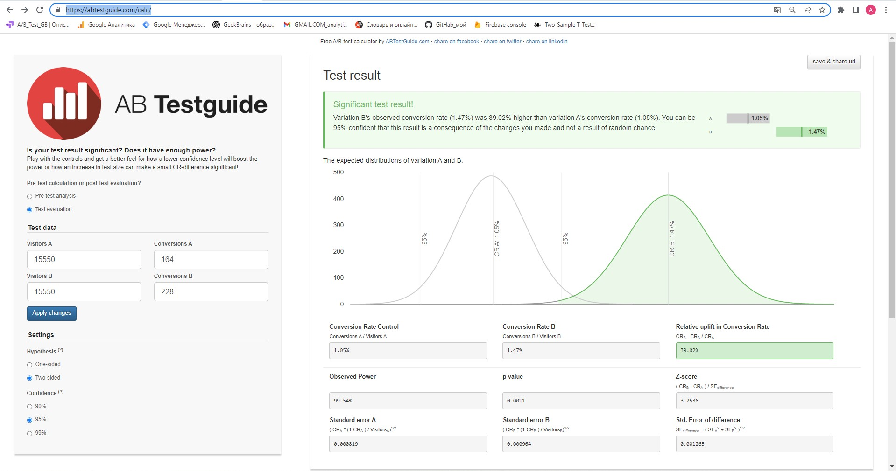

## A/B-тестирование (семинары).
## Урок 5.  
Применение математической статистики для проверки гипотез в реальной жизни для популярных метрик.  
### Задача 1.  
  Вы провели эксперимент c упрощением формы заказа в магазине Утконос и получили результаты по метрике конверсий в покупку.  
  Выберите метод оценки и оцените есть ли стат. значимые различия между конверсиями в двух группах при alpha = 5%.  
  Дайте краткие рекомендации команде.  
Результаты: 
   1)Число юзеров в группах , которые заходили на сайт в период эксперимента: n1 = 15550 и n2 = 15550 .  
   2) Число юзеров в группах , которые совершили хотя бы одну покупку за период эксперимента: n1 = 164 и n2 = 228.  
   3) Конверсии : conv1 = 1.05% conv2 = 1.47% .

A/B тестирование калькулятор https://abtestguide.com/calc/

Результат теста!  
 P_value = 0.0011, при alpha = 5% (0.0011<0.005/P_value<alpha) => *Наблюдаем!* стат. значимые различия между конверсиями =>  
 => принимаем и внедряем эксперимент n2.  
 Наблюдаемый коэффициент конверсии варианта B ( 1,47% ) был на 39,02% выше , чем коэффициент конверсии варианта A ( 1,05% ).  
Вы можете быть 95 % уверены, что этот результат является следствием внесенных вами изменений, а не результатом случайности.

2) Сравниваем метрику конверсия в покупку.  
   Размер выборки - 10000 элементов в каждой группе .  
   Какой статистический критерий тут лучше всего подойдёт и почему ?

